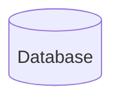
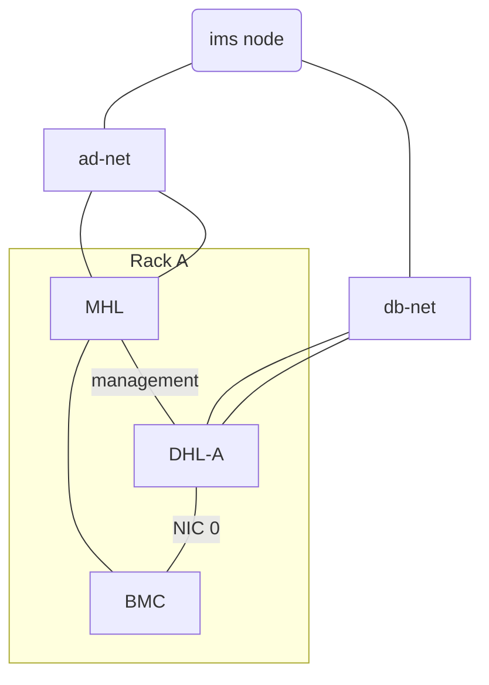

# Database Example

```mermaid
flowchart LR
    id1[(Database)]
```
# Network Diagram Example

```mermaid
graph TB
    IMS(ims node) --- ad-net
    IMS --- db-net

    ad-net --- MHL
    ad-net --- MHL
    
    db-net --- DHL-A
    db-net --- DHL-A

    MHL --- BMC
    DHL-A-- NIC 0 ---BMC

subgraph Rack A
    MHL-- management ---DHL-A
    BMC
end
```
